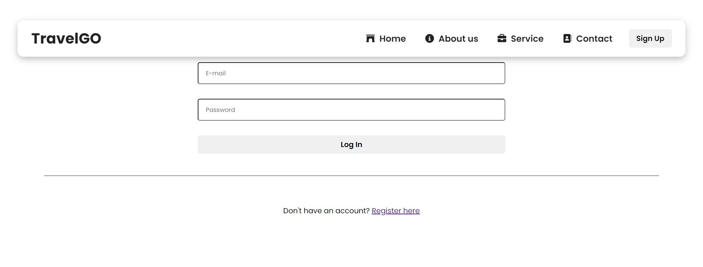

<h1 align="center" id="title">Travel GO</h1>

Developed TravelGO-Tours and Travels a responsive website using HTML CSS and React.js. Applied responsive design for optimal layout across diverse screens boosting accessibility. Enhanced project's maintainability and scalability with modular reusable React.js code practices.

<h2>Project Screenshots:</h2>
<h3>Screenshot 1</h3>

<h3>Screenshot 2</h3>

<h3>Screenshot 3</h3>

<h3>Screenshot 4</h3>

<h3>Screenshot 5</h3>

